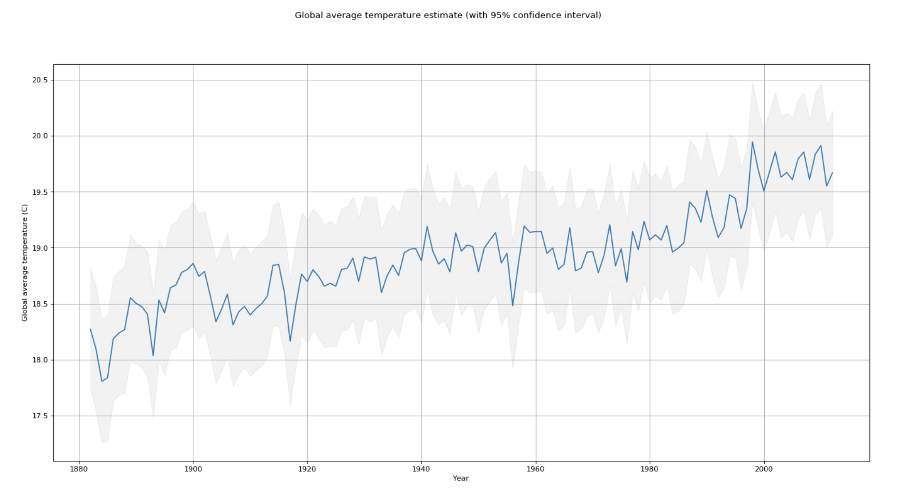

# Analysis of Earth's temperature history using Apache Spark

## Abstract

Analysis of global temperature data using Apache Spark

Work in progress

Author: Raphael Vannson

## Data

[https://www.kaggle.com/berkeleyearth/climate-change-earth-surface-temperature-data/home](https://www.kaggle.com/berkeleyearth/climate-change-earth-surface-temperature-data/home)

## Global land temp by major city

Source data: `GlobalLandTemperaturesByMajorCity.csv`

## Data selection
Done: ensured observations for each year are made in the same cities and during the same months.

## Mean history + confidence interval
Calculation + rendering: done

## Time-series histogram

An "improvement" on the grey area showing the 95% confidence interval. For each year (each 'x' value), the TS-interval will show a vertical histogram, (the bar height reported via variations shading).

Design in progress

